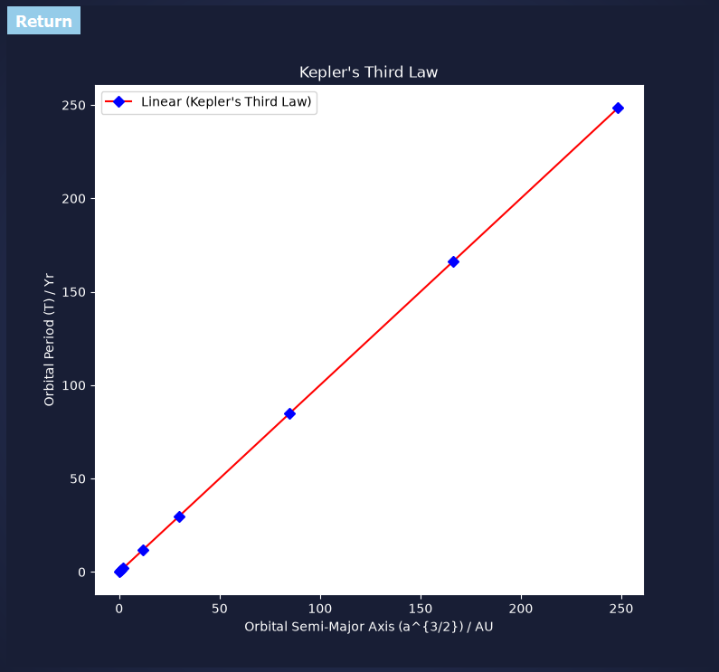
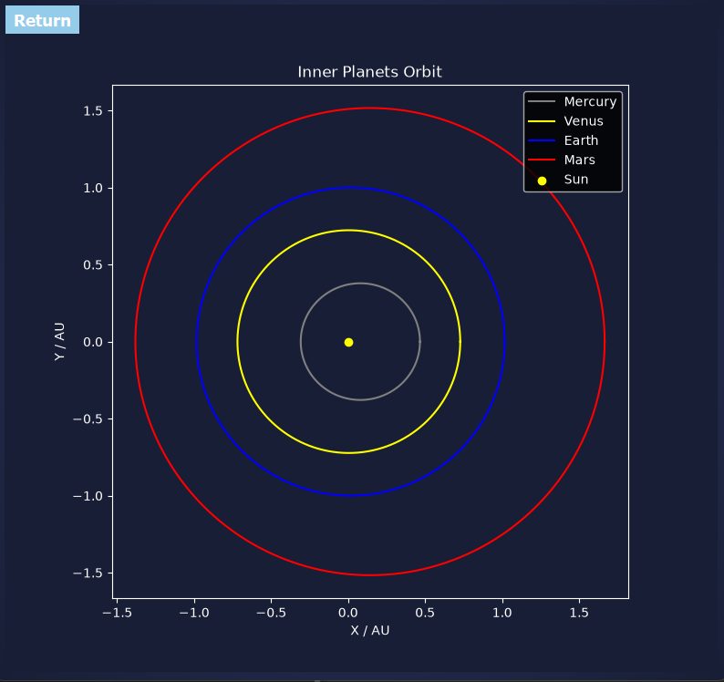
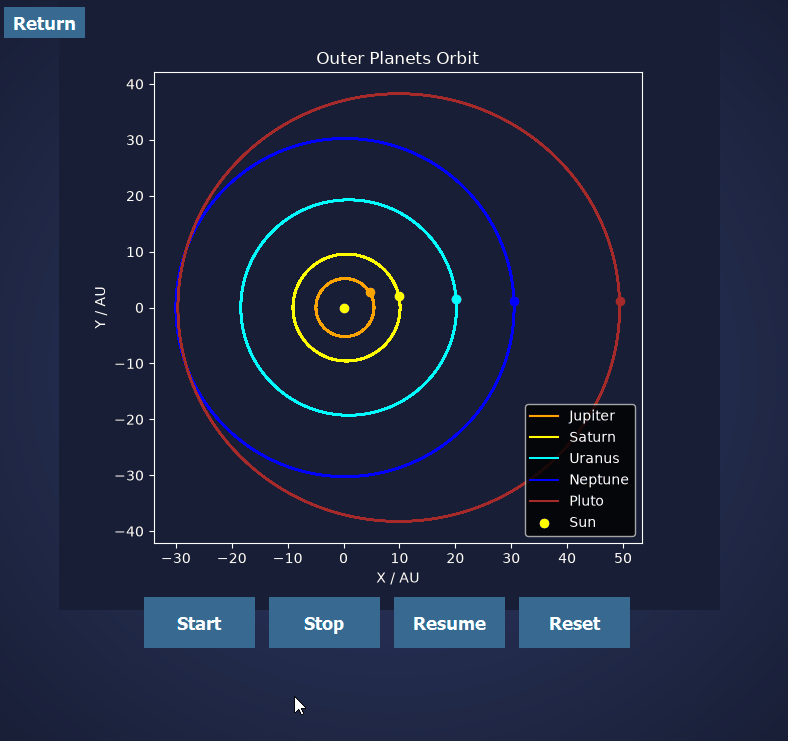
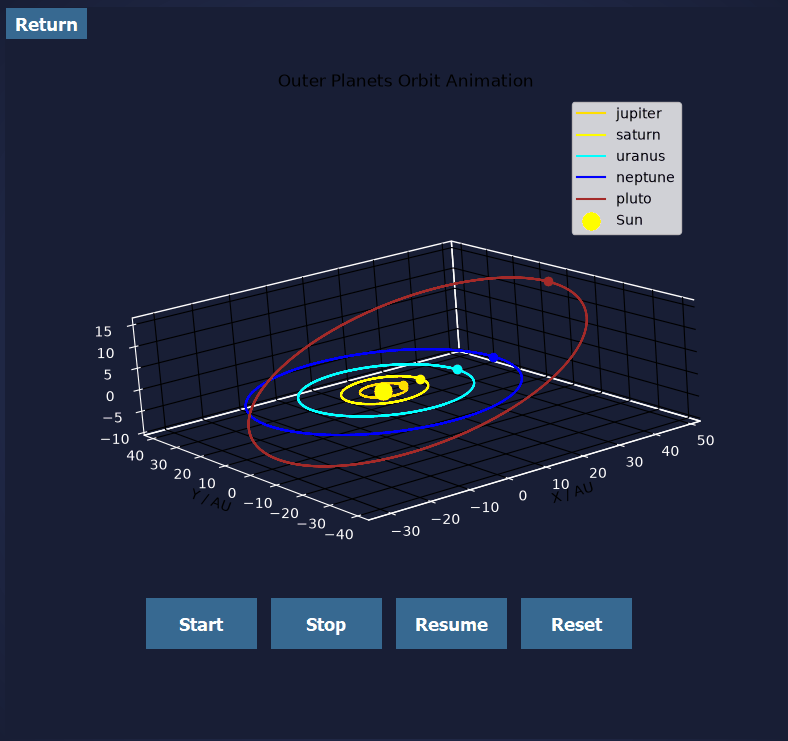
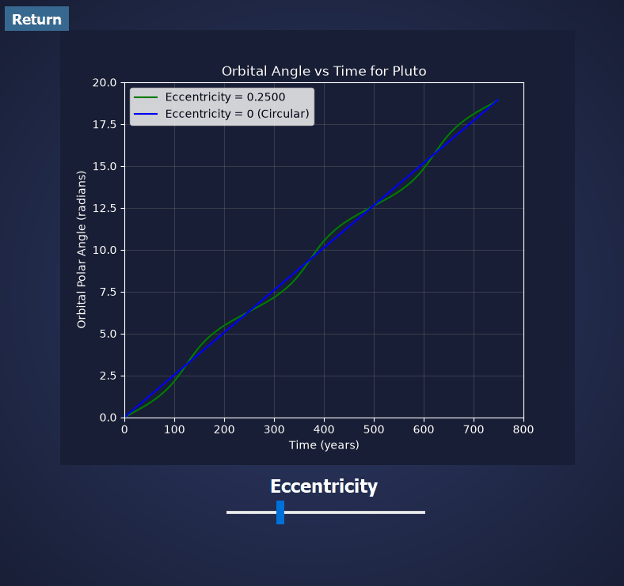
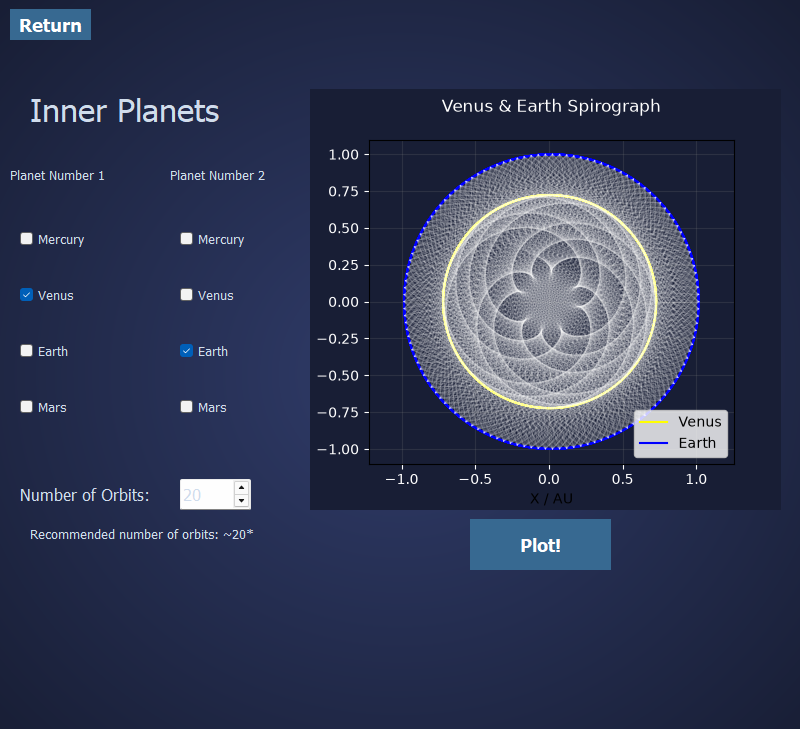
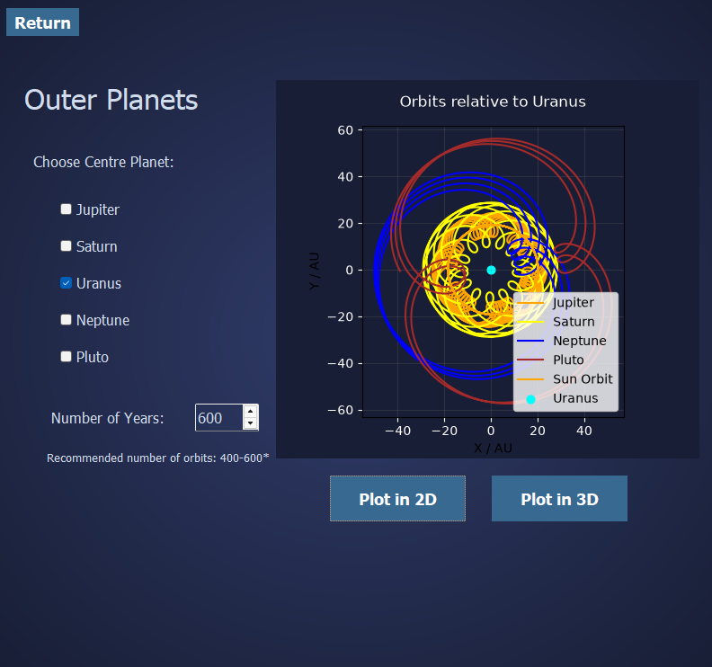

# Interactive Celestial Mechanics Simulator

An interactive desktop application simulating planetary orbital mechanics, built for the British Physics Olympiad Computational Challenge 2023. Awarded Gold 🏆.

All orbital mechanics are computed analytically using the polar equation of an ellipse, with no physics engine or third-party simulation library. The app was packaged with PyInstaller into a standalone .exe so it runs on any Windows machine without a Python installation.

## Features

Seven competition tasks are accessible from a central menu:

| # | Task | Highlights |
|---|---|---|
| 1 | **Kepler's Third Law** | Kepler's Third Law — T vs a³/² for all planets |
| 2 | **Static 2D Orbits** | Static 2D elliptical orbits (inner & outer solar system) |
| 3 | **Animated 2D Orbits** | Animated 2D orbits with Start / Stop / Resume / Reset |
| 4 | **Animated 3D Orbits** | Animated 3D orbits with true orbital inclinations |
| 5 | **Orbital Angle vs Time** | Numerically integrates Kepler's Second Law via Simpson's Rule, inverted with a cubic spline; interactive eccentricity slider |
| 6 | **Spirograph Patterns** | Connecting lines between any two planets over user-defined orbits, producing synodic patterns |
| 7 | **Relative Orbits** | Re-centres the solar system on any chosen planet; available in both 2D and 3D |

---

## Showcase
 
<table>
  <tr>
    <td></td>
    <td></td>
  </tr>
  <tr>
    <td align="center">Task 1 — Kepler's Third Law</td>
    <td align="center">Task 2 — Static 2D Orbits</td>
  </tr>
  <tr>
    <td></td>
    <td></td>
  </tr>
  <tr>
    <td align="center">Task 3 — Animated 2D Orbits</td>
    <td align="center">Task 4 — Animated 3D Orbits</td>
  </tr>
  <tr>
    <td></td>
    <td></td>
  </tr>
  <tr>
    <td align="center">Task 5 — Orbital Angle vs Time</td>
    <td align="center">Task 6 — Spirograph Patterns</td>
  </tr>
  <tr>
    <td></td>
    <td></td>
  </tr>
  <tr>
    <td align="center">Task 7 — Relative Orbits</td>
    <td></td>
  </tr>
</table> 

---

## Technical Overview

All orbital positions are derived analytically from the polar equation of an ellipse with the Sun at the focus:

```
r(θ) = a(1 − e²) / (1 − e·cos θ)
```

3D coordinates apply each planet's true orbital inclination *i*:

```
x = r·cos(θ)·cos(i),   y = r·sin(θ),   z = r·cos(θ)·sin(i)
```

Each task lives in its own module with a Matplotlib canvas class (subclassing Matplotlib's `FigureCanvasQTAgg`). Where a task comes in inner/outer or 2D/3D variants, those variants share a small per-task base class holding the common dark-theme styling and animation lifecycle, so each variant only defines its own set of planets. All the planet data (semi-major axis, period, eccentricity, inclination) lives in a single `planets.py`.

**Stack:** Python · PyQt5 · Matplotlib · NumPy · SciPy · PyInstaller

---

## Getting Started

### Option A — Standalone Executable (no Python required)

Download the latest `.exe` from the [Releases](../../releases) page and run it directly. Built with PyInstaller — no installation needed.

### Option B — Run from Source

```bash
git clone https://github.com/Amrovv/interactive-celestial-mechanics-simulator.git
cd interactive-celestial-mechanics-simulator
pip install -r requirements.txt
python src/App.py
```

**requirements.txt**
```
PyQt5>=5.15
matplotlib>=3.5
numpy>=1.21
scipy>=1.7
```

---

## Project Structure

```
interactive-celestial-mechanics-simulator/
├── src/
│   ├── App.py              # Main window, navigation, and event routing
│   ├── planets.py          # Shared planet data (distance, period, eccentricity, inclination)
│   ├── distance.py         # Orbital distance formula r(a, θ, e)
│   ├── PlanetClasses.py    # Planet and Planet3D coordinate generators
│   ├── TaskOne.py … TaskSeven.py   # One module per competition task
│   └── images/
│       ├── inner.jpg
│       └── outer.png
├── tests/
│   └── test_orbits.py      # Basic checks on the orbit maths
├── assets/
│   ├── screenshots/        # README images
│   └── animations/         # README GIFs
├── requirements.txt
└── README.md
```

## Authors

Built by **Adam** and **Dominykas** for the BPhO Computational Challenge 2023.
